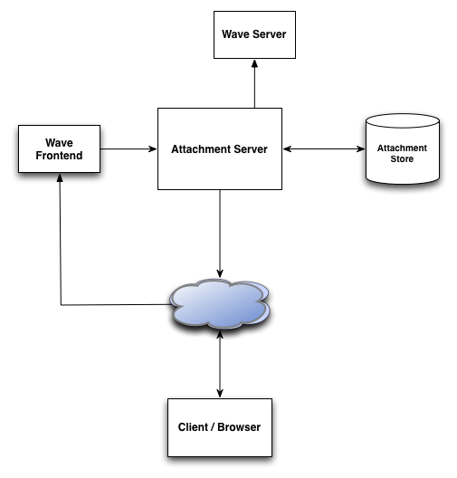

#######################
Google Wave Attachments
#######################

:Authors:
  Michael Lancaster

:Version: 1.0 - May 2009

Wave messages may contain embedded binary attachments, such as images, PDF
documents and ZIP archives. Because these binary files are qualitatively and
quantitatively different to other wave content (rich text), they are handled as
a somewhat special case within Google Wave. This document gives an overview on
how attachments are represented within Google Wave, and how the servers
interoperate to handle attachment uploading and serving.

This whitepaper is part of a series. All of the whitepapers
can be found on `Google Wave Federation Protocol site`_.

.. _Google Wave Federation Protocol site: http://www.waveprotocol.org/whitepapers

High level summary
##################

Attachments are represented within a wave by an XML document, allowing changes
(in upload progress, for instance) to be propagated to all users on the wave.
Each attachment has a corresponding thumbnail image. For image attachments,
this thumbnail is actually a small version of the image itself. In order to
reduce latency for image attachments, HTML5 or Gears enabled clients may
generate and upload a thumbnail before the image itself. For most other
attachment types, the thumbnail is a generic representation of the attachment
type (base on MIME type). Attachments are uploaded by the wave client using
HTTP POST, and download of both attachments and their thumbnails is done using
HTTP GET.

Architecture
############

Attachment management is handled by a dedicated attachment server. This server
is responsible for handling create, upload and download requests, generating
thumbnails, reprocessing images, malware scanning, as well as for
communications with the attachment store.

The attachment server acts as an HTTP server (for handling attachment
operations from the client), an RPC server (for handling attachment operations
from internal agents, such as the mail gateway), and an RPC client for
propagating attachment metadata to the wave server (see Google Wave Federation
Architecture for details on the overall Google Wave architecture).

Schema
######

Each attachment has a globally unique ID string, composed of the wave service
provider domain, and a string that is unique for that provider. An example
attachment ID for the wave sandbox wave provider would be
"wavesandbox.com/3eb1c8ba-172b-4b1a-ae5b-d3140ed85c42". Each attachment is
represented by a row in a replicated Bigtable (a Google proprietary scalable
distributed database). The attachment metadata is represented by a protocol
buffer stored in a column on that row. This protocol buffer contains such
fields as the attachment size, upload progress, filename of the attachment, as
well as a list of all wavelets that reference this attachment. The binary data
for the thumbnail and attachment are each stored in separate columns on the
same row.

Thus an attachment row in the Bigtable looks like:

AttachmentMetadata 
  contains the metadata protocol buffer,
ThumbnailData 
  used to store the thumbnail BLOB (binary large object),
AttachmentData 
  used to store the attachment BLOB, for small attachments

Large attachments are stored in a separate Bigtable for better storage
efficiency.

For performance, and simplicity of design, a subset of the attachment metadata
is also copied to any wavelets which reference the attachment. Storing this
metadata in the wavelet means that we don't have to do anything special at wave
load time to ensure that the client has a copy of the attachment metadata.
Whenever the attachment server makes a modification to the attachment metadata,
it pushes out the change to all relevant wavelets (via RPC to the wave
server(s)).

This copy of the metadata is represented by an XML sub-document on a data
document within the wavelet. The ID of the Data Document is based on the
attachment ID such that there is exactly one attachment data document for each
attachment on a given wavelet.

The attachment metadata XML sub-document is defined by the following RNC (Relax
NG) schema::

  element attachment {
    attribute attachmentId { text },
    attribute uploadProgress { xsd:integer },
    attribute attachmentSize { xsd:integer },
    attribute malware{ 0, 1 },
    attribute stalled { 0, 1 }? // default = 0
    attribute filename { text },
    attribute mimeType { text },
    attribute downloadToken { text },
    element thumbnail {
      attribute width { xsd:integer },
      attribute height { xsd:integer },
      attribute clientGenerated { 0, 1 }? // default=0
    }?
    element image {
      attribute width { xsd:integer },
      attribute height { xsd:integer }
   }?
  }

Changes to the attachment record are replicated to all waves which refer to
that attachment.

The blip in which the attachment was inserted also contains an XML node which
references the attachment, located at the insertion point of the attachment.
This XML element (known as the embed) is a placeholder for the thumbnail to be
rendered and takes the form::

  <w:image attachment="attachment id"><w:caption>the thumbnail caption</w:caption></w:image>

Attachment Creation
###################

Attachments may be "created" in several different ways:

* Uploading a thumbnail for the attachment
* Uploading the attachment blob itself (or the first N bytes)
* Linking an existing attachment to a new wave

Each of these actions is represented by an attachment creation request.
Attachment creation requests are sent as an HTTP POST, and may be either sent
as an HTTP multipart request (enctype=multipart/form-data), or as a plain POST
(enctype=application/x-www-form-urlencoded). The multipart POST is accepted to
allow file uploads from non-Gears / HTML5 enabled browsers.

In either case, the following fields may be sent either as HTTP POST
parameters, or in the HTTP header::

  required string attachmentId;
  required string waveletName;
  required int uploadType; // 0 for attachment, 1 for thumbnail
  optional bool complete; // true if data field represents the entire attachment
  optional int thumbnail_width;
  optional int thumbnail_height;

For the non-multipart case, the filename is also optionally provided in the
parameters / header.::

  optional string fileName;

and the bytes of the attachment / thumbnail are sent as the body of the POST.

In the multipart case, only the part with name set to "uploadAttachment" is
read, any other uploaded files are ignored. The filename is read from the
filename field in the content-disposition for the file.

Create requests are idempotent, so for instance it's okay to send one creation
request with a thumbnail, and another with the first chunk of the attachment
data. If the attachment record already exists, but the waveletName field does
not correspond to any of the wavelets currently linked to the attachment, the
existing attachment will be linked to the provided wavelet. Other fields which
are already present in the existing attachment will be ignored.

Example creation flow:

1. User initiates attachment creation by dragging an image into the browser (using Gears)

2. Client generates a globally unique ID for the attachment

3. Client thumbnails the image (using Gears) and displays it locally by adding an <image> tag to the blip (other clients seeing the <image> tag will display an empty thumbnail frame). The client then sends an HTTP POST containing a create request, and the thumbnail data, to the Attachment server (via WFE)

4. Attachment server creates a record in permanent storage for the attachment and stores the (re-encoded for security) user-provided thumbnail

5. Attachment server returns success to the client

6. Attachment server creates a data document on the wavelet and adds a copy of the attachment metadata.

7. Thumbnail is now ready to download

8. Client sends an HTTP POST containing the attachment

9. Attachment server updates the attachment record in permanent storage

10. Attachment server returns success to the client

11. Attachment server generates a thumbnail for the attachment

12. Image attachments are reprocessed to prevent XSS attacks, and attachments are scanned for malware

13. Attachment server updates the attachment data document on the wavelet

14. Attachment is now ready to download

Steps 8-14 may happen in parallel with 3-7.

Below is an example of a multipart (non-Gears) creation request::

  POST /wfe/upload/result HTTP/1.1
  Host: wave.google.com
  Content-Type: multipart/form-data; boundary=---------------------------10102754414578508781458777923
  Content-Length: 195197
  -----------------------------10102754414578508781458777923
  Content-Disposition: form-data; name="uploadAttachment"; filename="Downtown.pdf"
  Content-Type: application/pdf

  <encoded attachment binary data here>

  -----------------------------10102754414578508781458777923
  Content-Disposition: form-data; name="waveletName"

  wavesandbox.com/w+6bf32acc-bd29-45c2-a252-699af690f5a6/conv+root
  -----------------------------10102754414578508781458777923
  Content-Disposition: form-data; name="attachmentId"

  wavesandbox.com/3eb1c8ba-172b-4b1a-ae5b-d3140ed85c42

  -----------------------------10102754414578508781458777923
  Content-Disposition: form-data; name="uploadType"

  0
  -----------------------------10102754414578508781458777923--

Uploading
#########

Clients may upload large attachments in multiple chunks using an upload request::

  required string attachmentId;
  required int offset;
  optional int fullSize;

The binary data is sent as per the creation request. Either multipart or form
POSTs are accepted.

An upload request may not be sent until the upload request (or create request)
for the previous chunk has been acknowledged. That is, we don't currently
support pipelining. Chunks must not overlap. Behaviour is not specified if
chunk boundaries overlap.

The response to HTTP upload / create requests is a string containing a single
JSON object of the form::

  {
    responseCode: <response>,
    errorMessage: "<error message> "
  }

Possible values for the responseCode field are::

  0 (OK) 
  1 (INVALID_TOKEN)
  2 (INVALID_REQUEST) 
  1000 (INTERNAL_SERVER_ERROR)

The errorMessage field will not be provided for the non-error case (OK).
Otherwise, it will contain a human-readable (although not necessarily end-user
friendly) error message.

In conjunction with these custom error codes, HTTP response codes should also
be respected, however, due to limitations with cross-domain POSTs, the JSON
response codes are used in preference.

Attachment / Thumbnail download
###############################

A download request takes the following form::

  required string attachmentId;
  required string downloadToken;

Requests for thumbnails / attachments are sent on different URLs, but otherwise
look identical.

The response to these requests is an HTTP response containing the bytes of the
attachment / thumbnail, with the HTTP Content-Disposition header set to
"attachment". The mime type of the response is set to the mime type of the
attachment or thumbnail.

Authentication / Authorization
##############################

Google web-apps use a centralized cookie-based authentication system.
Authentication for upload and creation requests uses this system. In order to
write the corresponding attachment data document into an associated wavelet,
the user must be a participant on that wavelet. 

Downloads are authenticated using a download token which is stored in the
attachment data document on the wavelet. Thus to download an attachment or a
thumbnail, the user must at some point in time have had access to both the
attachment id and the download token. 

Duplicate elimination
#####################

Because we expect a large percentage of attachments to be duplicates, we have
an offline de-duping procedure. We store a weak hash with each attachment, and
an offline process indexes attachments by hash, detects collisions, and then
does a byte-by-byte comparison to eliminate duplicates. This is only done on
attachments that are completely uploaded, and effectively immutable, and only
on 'large' blobs, which are stored in a separate store. We maintain a level of
indirection for these large blobs, so that we don't have to update the pointers
upon duplicate detection and to prevent the leakage of information about the
existence of previously uploaded attachments.

References
##########

* E. Nebel and L. Masinter, `Form-based File Upload in HTML <http://www.ietf.org/rfc/rfc1867.txt>`_, IETF RFC 1867, November 1995
* F. Chang et al., `Google Research Publication: Bigtable <http://labs.google.com/papers/bigtable.html>`_, OSDI'06: Seventh Symposium on Operating System Design and Implementation, November 2006.
* S. Lassen and S. Thorogood, `Google Wave Federation Architecture <http://www.waveprotocol.org/whitepapers/google-wave-architecture>`_, June 2009
