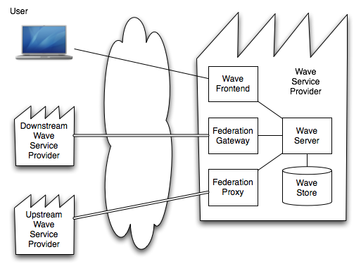
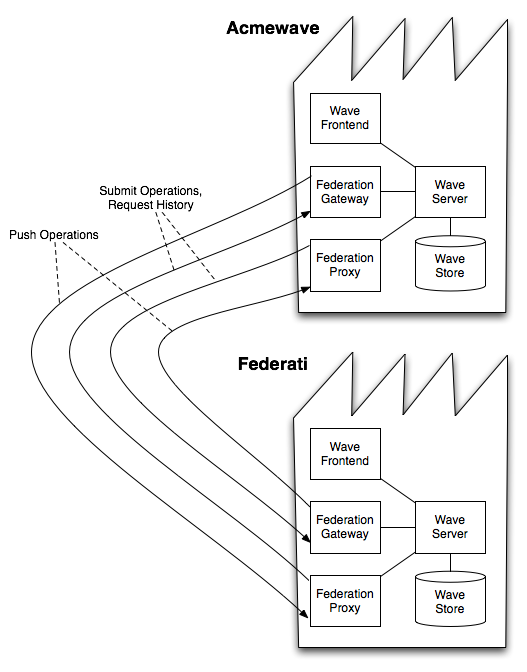

####################################
Google Wave Federation Architecture 
####################################

:Authors: 
    Soren Lassen, 
    Sam Thorogood

:Version: 1.0 - May 2009

This whitepaper is part of a series. All of the whitepapers
can be found on `Google Wave Federation Protocol site`_.

.. _Google Wave Federation Protocol site: http://www.waveprotocol.org/whitepapers

Google Wave is a new communication and collaboration platform based on hosted
documents (called waves) supporting concurrent modifications and low-latency
updates. This platform enables people to communicate and work together in new,
convenient and effective ways. We will offer these benefits to users of
http://wave.google.com and we also want to share them with everyone else by making
waves an open platform that everybody can share. We welcome others to run wave
servers and become wave providers, for themselves or as services for their
users, and to "federate" waves, that is, to share waves with each other and
with http://wave.google.com. In this way users from different wave providers can
communicate and collaborate using shared waves. We are introducing the Google
Wave Federation Protocol for federating waves between wave providers on the
Internet.

This document gives an overview of how various elements of Google Wave
technology -- data model, operational transformation, and client-server 
protocol -- are used together to run a wave service, and how wave service
providers communicate using the Google Wave Federation Protocol with its
cryptographic measures to prevent spoofing.  All these elements are described
in more depth in accompanying documents on this site and the reader is
encouraged to consult them for more details.  The focus of this document is
federation, which involves the server-server wave federation protocol, and does
not cover the client-server protocol between the clients and the wave server of
a wave provider.  Nonetheless, this document is far from an exhaustive account
of wave federation. In particular, attachments_, groups, contacts, and presence
are important elements of wave federation that are not covered herein.

.. _attachments: http://www.waveprotocol.org/whitepapers/google-wave-attachments

Wave Providers
##############

The wave federation protocol enables everyone to become a wave provider and
share waves with others. For instance, an organization can operate as a wave
provider for its members, an individual can run a wave server as a wave
provider for a single user or family members, and an Internet service provider
can run a wave service as another Internet service for its users as a
supplement to email, IM, ftp, etc. In this model, wave.google.com is one of
many wave providers.

A wave provider is identified by its Internet domain name(s).

Wave users have wave addresses which consist of a user name and a wave provider
domain in the same form as an email address, namely <username>@<domain>. Wave
addresses can also refer to groups, robots, gateways, and other services. A
group address refers to a collection of wave addresses, much like an email
mailing list. A robot is an automated participant on a wave (see the `Robots
API`_). Examples are translation robots and chess game robots. A gateway
translates between waves and other communication and sharing protocols such as
email and IM.  In the remainder we ignore addresses that are services,
including robots and gateways; they are treated largely the same as users with
respect to federation.

.. _Robots API: http://code.google.com/apis/wave/extensions/robots/index.html

Wave users access all waves through their wave provider. If a wave has
participants from different wave providers, their wave providers all maintain a
copy of the wave and serve it to their users on the wave. The wave providers
share updates to the wave with each other using the wave federation protocol
which we describe below.  For any given wave user, it is the responsibility of
the wave provider for the user's domain to authenticate the user (using cookies
and passwords, etc) and perform local access control.

Waves, Wavelets, and Identifiers
################################

A wave consists of a set of wavelets. When a user has access to a wavelet, that
user is called a participant of that wavelet. Each wavelet has a list of
participants, and a set of documents that make up its contents. Different
wavelets of a wave can have different lists of participants. Copies of a
wavelet are shared across all of the wave providers that have at least one
participant in that wavelet. Amongst these wave providers, there is a
designated wave provider that has the definitive copy of that wavelet.  We say
that this particular provider is hosting that wavelet.

When a user opens a wave, a view of the wave is retrieved, namely the set of
wavelets in the wave that the user is a participant of (directly, or indirectly
via group membership). In general, different users have different wave views
for a given wave. For example, per-user data for a user in a wave, such as the
user's read/unread state for the wave, is stored in a user-data wavelet in the
wave with the user as the only participant. The user-data wavelet only appears
in this user's wave view. Another example is a private reply within a wave,
which is represented as a wavelet with a restricted participant list. The
private reply wavelet is only in the wave views of the restricted list of
users.

A wave is identified by a globally unique wave id, which is a pair of a domain
name and an id string. The domain names the wave provider where the wave
originated.

A wavelet has a wavelet id which is unique within its wave. Like a wave id, a
wavelet id is a pair of a domain name and an id string. The domain name in the
wavelet id plays a special role: It names the wave provider that hosts the
wavelet. A wavelet is hosted by the wave provider of the participant who
creates the wavelet. The wave provider who hosts a wavelet is responsible both
for operational transformation and application of wavelet operations to the
wavelet and for sharing the updates with the wave providers of all the wavelet
participants, as described in the Wave Servers section below. The updates are
wavelet operations and concurrent updates are resolved using operational
transformation.

Wavelets in the same wave can be hosted by different wave providers. For
example, a user-data wavelet is always hosted by the user's wave provider,
regardless of where the rest of the wave is hosted. Indeed, user-data is not
federated, i.e., not shared with other wave providers. Another example is a
private reply wavelet. A particularly simple instance of this is when all the
participants of the private reply are from the same wave provider. Then this
wave provider will not share the private reply wavelet with other wave
providers, regardless of where the other wavelets in the wave are hosted.

Wave Service Architecture
#########################

A wave provider operates a wave service on one or more networked servers. The
central pieces of the wave service is the wave store, which stores wavelet
operations, and the wave server, which resolves wavelet operations by
operational transformation and writes and reads wavelet operations to and from
the wave store. Typically, the wave service serves waves to users of the wave
provider which connect to the wave service frontend (see the `Google Wave Data
Model and Client-Server Protocol`_), and we shall assume this in the following
description of the wave service architecture. More importantly, for the purpose
of federation, the wave service shares waves with participants from other
providers by communicating with these wave provider's servers. The wave service
uses two components for this, a federation gateway and a federation proxy. They
are described in the next section.

A wave provider's wave server serves wave views to local participants, i.e.,
participants from its domain. As described earlier, copies of a wavelet are
distributed to all wave providers that have participants in that wavelet.
Copies of a wavelet at a particular provider can either be local or remote. We
use the term "local wavelet" and "remote wavelet" to refer to these two types
of wavelet copies (in both cases, we are referring to the wavelet copy, and not
the wavelet). A wave view can contain both types of wavelet copies
simultaneously.

At a particular wave provider, local wavelets are those created at that
provider, namely by users who belong to the wavelet provider.  The wave server
is responsible for processing the wavelet operations submitted to the wavelet
by local participants and by remote participants from other wave providers. The
wave server performs concurrency control by ordering the submitted wavelet
operations relative to each other using operational transformation. It also
validates the operations before applying them to a local wavelet.

Remote wavelets are hosted by other wave providers. The wave server maintains
cached copies locally and updates them with wavelet operations that it gets
from the hosting wave providers. When a local participant submits a wavelet
operation to a remote wavelet, the wave server forwards the operation to the
wave server of the hosting provider.  When the transformed and applied
operation is echoed back, it is applied to the cached copy. Read access to
local participants is done from the cached copy without a round trip to the
hosting wave provider.

Local and remote wavelets are all stored in the wave server's persistent wave
store.

We say that a wave provider is "upstream" relative to its local wavelets and
that it is "downstream" relative to its remote wavelets.

Federation Gateway and Federation Proxy
#######################################

The wave service uses a federation gateway and a federation proxy component to
communicate with other wave providers.

The federation gateway communicates local wavelet operations, i.e., operations
on local wavelets: 
* It pushes new wavelet operations that are applied to a local wavelet to the wave providers of any remote participants.  
* It satisfies requests for old wavelet operations.  
* It processes wavelet operations submission requests.

The federation proxy communicates remote wavelet operations and is the
component of a wave provider that communicates with the federation gateway of
remote providers: 
* It receives new wavelet operations pushed to it from the wave providers that host the remote wavelets.  
* It requests old wavelet operations from the hosting wave providers.  
* It submits wavelet operations to the hosting wave providers.

An upstream wave provider's federation gateway connects to a downstream wave
provider's federation proxy to push wavelet operations that are hosted by the
upstream wave provider.

The federation protocol has the following mechanisms to make operation delivery
from gateway to proxy reliable. The federation gateway maintains (in persistent
storage) a queue of outgoing operations for each remote domain. Operations are
queued until their receipt is acknowledged by the receiving federation proxy.
The federation gateway will continually attempt to establish a connection and
reconnect after any connection failures (retrying with exponential backoff).
When a connection is established, the federation gateway will send queued
operations in order. The receiving federation proxy sends acknowledgements back
to the sending federation gateway on a back channel and whenever an
acknowledgement is received, the sender dequeues the acknowledged operations.

Example

Consider the case of a wavelet W with wavelet id (acmewave.com, conv+090528),
where acmewave.com is a domain and "conv+090528" is an id string (whose
structure does not concern us here). The wavelet id dictates that W is hosted
by the Acmewave wave provider. Suppose W has a participant feddy@federati.com
from another domain federati.com.

All wavelet operations for W, submitted by local and remote participants alike,
are transformed, applied to W, stored in the local wave store by the Acmewave
wave provider, and then the applied operations are passed to the federation
gateway which pushes them to federati.com. The Acmewave gateway does so by
establishing a connection to the Federati federation proxy and sending the
operations across the connection.

Sometimes the receiver needs to request past operations from the sender. The
typical case is when it receives an operation for a wavelet where the receiver
does not already posses all preceding operations for the wavelet. (This
condition is easily verified because applied operations carry consecutive
version numbers.) In this case the receiving federation proxy will connect to
the domain that hosts the wavelet and request the past operations that it is
missing. (One way that a wave server can develop such a gap in the operation
history for a remove wavelet is when no participant from its domain
participates in the wavelet, at time t1, and then later, at time t2, a
participant from its domain is added to the wavelet. The host federation
gateway responds by sending the new AddParticipant operation forwarding all
ensuing new operations to the federation proxy, but the latter must itself turn
around and request the prior operations.)

In the same way a user can submit operations to a remote wavelet, namely by
letting the federation proxy connect to the remote federation proxy and submit
the operation to its wave server.

Suppose there is another wavelet hosted by Federati, i.e., the wavelet id
domain is federati.com, and this wavelet has a participant which is a user at
acmewave.com.  Then the Federati gateway and Acmewave gateway will also
communicate with each other.

Protocol
########

The network protocol between federation gateways and proxies is called the
Google Wave Federation Protocol. It is an open extension to the XMPP Internet
Messaging protocol. Some of key useful features of XMPP that the wave
federation protocol uses are the discovery of IP addresses and ports, using SRV
records, and TLS authentication and encryption of connections. See "Google Wave
Federation Protocol".

The XMPP transport encrypts operations at a transport level, so it only
provides cryptographic security between servers that connect directly to each
other. An additional layer of cryptography provides end-to-end authentication
between wave providers using cryptographic signatures and certificates,
allowing all wavelet providers to verify the properties of the operation.
Specifically, a downstream wave provider can verify that the wave provider is
not spoofing wavelet operations, namely, it cannot falsely claim (1) that a
wavelet operation originated from a user on another wave provider or (2) that
it was originated in a different context.  This addresses the situation where
two users from different, trustworthy wave providers, say love.com and
peace.com, are participants of the a wavelet that is hosted on a malicious wave
provider evil.com.  The protocol requires love.com to sign its user's
operations with love.com's certificate and peace.com to sign its user's
operations with peace.com's certificate.  These signatures travel with the
operations and evil.com must host the signatures together with the operations.
Furthermore, love.com and peace.com will verify the signatures of all the
operations that evil.com forwards.  This makes it impossible for evil.com to
alter or spoof the content of the messages from the user of love.com which is
shared with peace.com, and vice versa.  All the signing and verification is
done by the wave providers, not the client software of the end users.

.. image:: img/love.png

The protocol specification requires that wave providers connecting using the
federation protocol must authenticate using cryptographically secure TLS
mechanisms.  Moreover, it is recommended that they use TLS to encrypt the
traffic between them. The client-server and federation protocols do not provide
end-to-end authentication or encryption between end users.  A wave provider
should authenticate its end users and encryption of user connections is also
recommended. In combination, secure connections between wave services and
secure connections between users and their wave services offer a reasonable
level of end-to-end security.  

References
##########

Jochen Bekmann, Michael Lancaster, Soren Lassen, David Wang: `Google Wave Data Model and Client-Server Protocol`_

David Wang, Alex Mah: `Google Wave Operational Transformation`_

Daniel Berlin: `Google Wave Federation Protocol`_

Lea Kissner and Ben Laurie: `General Verifiable Federation`_

.. _Google Wave Operational Transformation: http://www.waveprotocol.org/whitepapers/operational-transform 
.. _Google Wave Data Model and Client-Server Protocol: http://www.waveprotocol.org/draft-protocol-specs/draft-protocol-spec
.. _Google Wave Federation Protocol: http://www.waveprotocol.org/draft-protocol-specs/draft-protocol-spec
.. _General Verifiable Federation: http://www.waveprotocol.org/whitepapers/wave-protocol-verification

