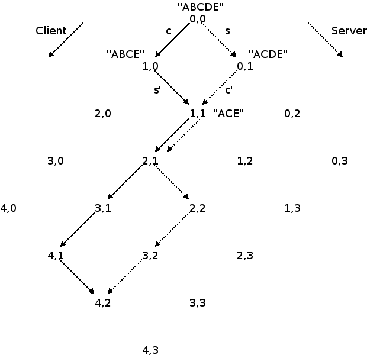
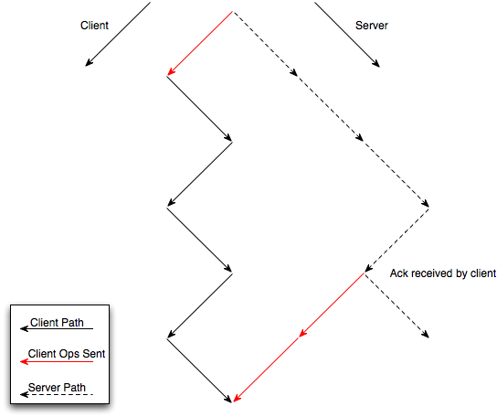
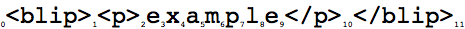
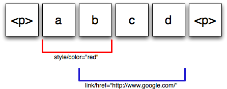
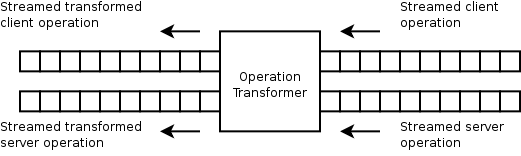

######################################
Google Wave Operational Transformation
######################################

:Authors: 
  David Wang, 
  Alex Mah,
  Soren Lassen

:Version: 1.1 - July 2010

This whitepaper is part of a series. All of the whitepapers
can be found on `Google Wave Federation Protocol site`_.

.. _Google Wave Federation Protocol site: http://www.waveprotocol.org/whitepapers

Waves are hosted, structured documents that allow seamless and low latency concurrent
modifications.  To provide this live experience, Google Wave uses the Operational
Transformation (OT) framework of concurrency control.

Executive Summary
#################

Collaborative document editing means multiple editors are able to edit a
shared document at the same time. It is live and concurrent when a user can see
the changes another person is making, keystroke by keystroke.
Google Wave offers live concurrent editing of rich text documents.

The result is that Google Wave allows for a very engaging conversation where you can
see what the other person is typing, character by character, much like how you
would converse in a cafe. This is very much like instant messaging except you
can see what the other person is typing, live. Google Wave also allows for a more
productive collaborative document editing experience, where people don't have
to worry about stepping on each others toes and still use common word processor
functionalities such as bold, italics, bullet points, and headings.

Waves are more than just rich text documents. In fact, Google Wave's core technology
allows live concurrent modifications of structured documents which can be used to
represent any structured content including system data that is shared between
clients and backend systems.

To achieve these goals, Google Wave uses a concurrency control system based on
Operational Transformation.

Introduction
############

Operational transformation (OT) is a theoretical framework of concurrency
control that has been continuously researched in the context of group editing
for more than 10 years. This document does not describe the basic theory of OT
and assumes the reader understands OT. The reader is encouraged to read the
documents in the reference section for background.

In short, Wave OT replicates the shared document at all sites and allows any
user to edit any part of the document at any time. Local editing operations are
executed without being delayed or blocked. Remote operations are transformed
before execution. The lock-free, non-blocking property of OT makes the local
response time insensitive to networking latencies. These properties of OT play
a big part in providing the Optimistic User Interface (UI) of Wave. Optimistic
UI means user actions are executed and displayed locally to the user
immediately without waiting for the server to respond.

The starting point for Wave OT was the paper "High-latency, low-bandwidth
windowing in the Jupiter collaboration system". Like the Jupiter system
described by the paper, Google Wave also implements a client and server based OT
system. The reader is again encouraged to read this paper for background.

This document describes the extensions Google Wave made to the basic theory of OT.

Wave Extensions to Operational Transformation 
##############################################

A wave is a collection of wavelets. A wavelet contains a collection of documents.
A document consists of a structured, XML-like document and some annotations.
A wavelet is where concurrent modification takes place.
A wavelet is the object on which OT is applied.

Clients wait for acknowledgement from server before sending more operations
===========================================================================

To recap, under the basic theory of OT, a client can send operations
sequentially to the server as quickly as it can. The server can do the same.
This means the client and server can traverse through the state space via
different OT paths to the same convergent state, depending on when they receive
the other parties' operations. See diagram below.

When you have multiple clients connected to the server, every client and server
pair have their own state space. One shortcoming of this is the server needs
to carry a state space for every connected client, which can be
memory-intensive. In addition, this complicates the server algorithm by
requiring it to convert clients' operations between state spaces.

Having a simple and efficient server is important in making waves reliable and
scalable. With this goal, Wave OT modifies the basic theory of OT by requiring
the client to wait for acknowledgement from the server before sending more
operations. When a server acknowledges a client's operation, it means the
server has transformed the client's operation, applied it to the server's copy
of the wavelet and broadcast the transformed operation to all other connected
clients. Whilst the client is waiting for the acknowledgement, it caches
operations produced locally and sends them in bulk later.

With the addition of acknowledgements, a client can infer the server's OT path.
We call this the inferred server path. By having this, the client can send
operations to the server that are always on the server's OT path. 

This has the important benefit that the server only needs to have a single
state space, which is the history of operations it has applied. When it
receives a client's operation, it only needs to transform the operation against
the operation history, apply the transformed operation, and then broadcast it.

One trade-off of this simplification is that a client will see chunks of operations
from another client in intervals of approximately one round trip time to the
other client. We believe the server-side benefits make this a worthwhile trade-off.

Wavelet Operations
##################

Wavelet operations consist of document operations, for modifying documents,
and non-document operations, for tasks such
as adding or removing a wavelet participant. We'll focus on document
operations here.

Document Support
================

A document operation has a streaming interface, similar to an
XMLStreamWriter or a SAX handler. The document operation consists of a sequence
of ordered document mutations. The mutations are applied in sequence as you
traverse the document linearly. 

Designing document operations in this manner makes it easier to write the
transformation function and composition function described later.

A wave document can be regarded as a single
document operation that can be applied to the empty document.

In Google Wave, every character, start tag or end tag in a document is called an item. Gaps
between items are called positions. Position 0 is before the first item. A
document operation can contain mutations that reference positions. For example,
a "Retain" mutation specifies how many positions to skip ahead in the
document before applying the next mutation.

Wave document operations also support annotations. An annotation is some
meta-data associated with an item range, i.e., a start position and an end
position. This is particularly useful for describing text formatting and
spelling suggestions, as it does not unecessarily complicate the underlying structured
document format.

Wave document operations consist of the following mutation components:

* retain
* insert characters
* insert element start
* insert element end
* delete characters
* delete element start
* delete element end
* replace attributes
* update attributes
* annotation boundary
 
The following is a more complex example document operation.::

  retain 3
  insert element start with tag "p" and no attributes
  insert characters "Hi there!"
  insert element end
  retain 5
  delete characters 4
  retain 2

From this, one can see how an entire document can be represented as a
single document operation. 

Transformation Function
=======================

Representing document operations using a stream interface has the benefit that
it makes processing operations in a linear fashion easy.

The operation transformer works by taking two streaming operations as input,
simultaneously processing the two operations in a linear fashion, and
outputting two streaming operations. This stream-style processing ensures that
transforming a pair of very large operations is efficient.

Composition
===========

The document operations have been engineered so that they can be composed
together and the composition of any two document operations that can be
composed together is itself a single document operation.

Furthermore, the composition algorithm processes operations as linear streams,
so the composition algorithm is efficient.

.. image:: img/composition.png

The composition B∙A has the property that (B∙A)(d) = B(A(d))
for all documents d on which A can be applied.

While a Wave client awaits server acknowledgement, it composes all its
pending operations. This reduces the number of operations to transform
and send.

References
##########

"Operational transformation". In Wikipedia, the free encyclopedia, May 28, 2009. http://en.wikipedia.org/wiki/Operational_transformation

David A. Nichols, Pavel Curtis, Michael Dixon, and John Lamping: `High-latency, low-bandwidth windowing in the Jupiter collaboration system`_, UIST '95: Proceedings of the 8th annual ACM symposium on User interface and software technology, pp.111-120. ACM, 1995.

.. _High-latency, low-bandwidth windowing in the Jupiter collaboration system: http://doi.acm.org/10.1145/215585.215706

